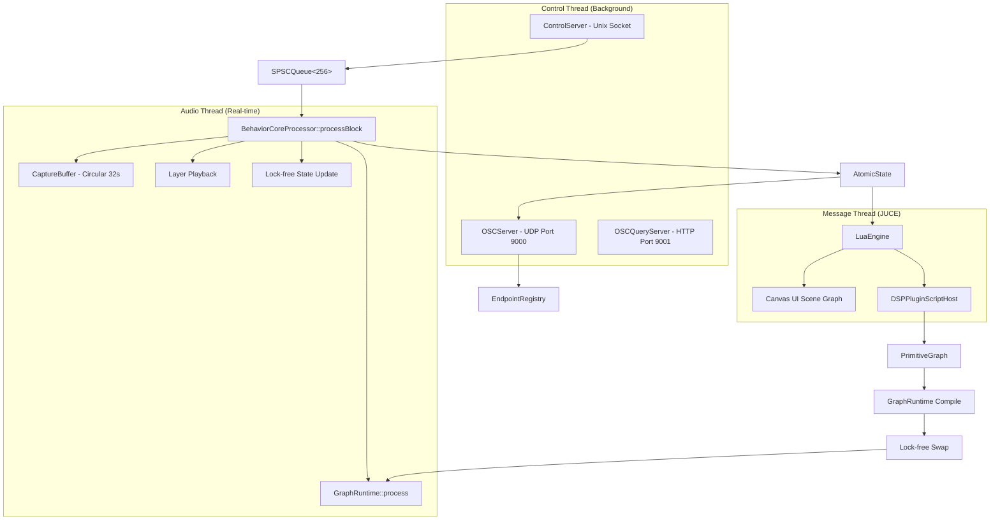
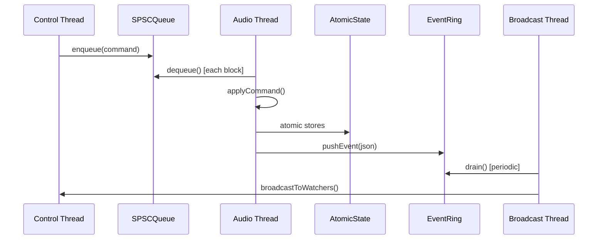
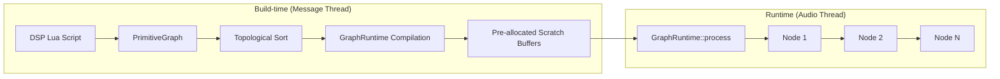
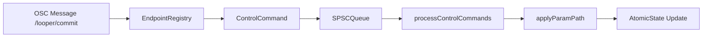
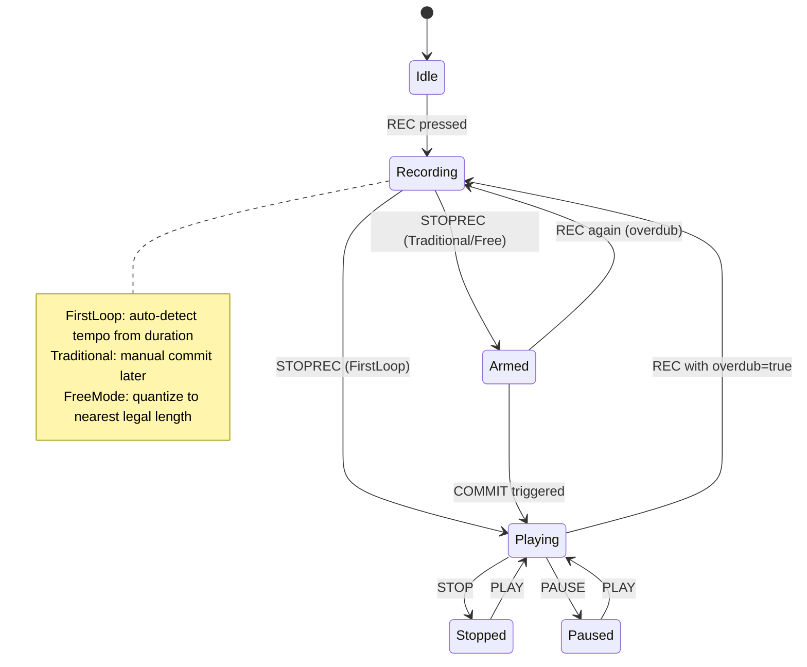
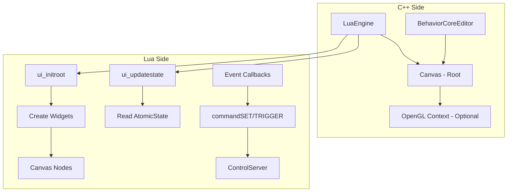

# Manifold Audio Looper

A real-time multi-layer audio looper built on JUCE with scriptable DSP and UI. Designed for live performance with lock-free threading, Ableton Link synchronization, and network control via OSC.

---

## Architecture Overview



---

## Core Design Principles

### Lock-free Real-time Safety

All audio processing avoids locks. The architecture uses three lock-free mechanisms:

| Mechanism | Direction | Purpose |
|-----------|-----------|---------|
| `SPSCQueue<256>` | Control → Audio | Command dispatch (record, play, param changes) |
| `EventRing<256>` | Audio → Control | State change broadcast (JSON events) |
| `AtomicState` | Audio → Control | Lock-free state snapshots for UI/query |



### Graph-based DSP

DSP is organized as a node graph that compiles to a lock-free runtime:



Node types include:
- `LoopPlaybackNode` - Layer sample playback with speed/pitch
- `RecordStateNode` - Recording state machine
- `RetrospectiveCaptureNode` - Always-recording circular buffer
- `QuantizerNode` - Tempo-aware quantization
- `PlayheadNode` - Position/speed/reverse control
- `FilterNode`, `ReverbNode`, `DistortionNode` - Effects

---

## Directory Structure

```
├── looper/
│   ├── engine/
│   │   └── LooperLayer.h           # Legacy layer class (crossfade, playhead)
│   ├── primitives/
│   │   ├── control/
│   │   │   ├── ControlServer.h/cpp # Unix socket IPC (/tmp/looper.sock)
│   │   │   ├── OSCServer.h/cpp     # UDP OSC input/output
│   │   │   ├── OSCQuery.h/cpp      # HTTP OSCQuery auto-discovery
│   │   │   ├── OSCEndpointRegistry.cpp # Endpoint metadata
│   │   │   └── EndpointResolver.*  # Path resolution for SET/GET/TRIGGER
│   │   ├── dsp/
│   │   │   ├── CaptureBuffer.h     # Circular buffer for live input
│   │   │   ├── LoopBuffer.h        # Layer audio storage
│   │   │   ├── Playhead.h          # Speed/direction control
│   │   │   ├── Quantizer.h         # Bar/beat quantization
│   │   │   └── TempoInference.h    # Auto-tempo detection
│   │   ├── scripting/
│   │   │   ├── LuaEngine.h/cpp     # UI scripting VM
│   │   │   ├── DSPPluginScriptHost.* # DSP scripting VM
│   │   │   ├── PrimitiveGraph.*    # Node graph builder
│   │   │   └── GraphRuntime.*      # Lock-free graph executor
│   │   ├── sync/
│   │   │   └── LinkSync.*          # Ableton Link integration
│   │   └── ui/
│   │       ├── Canvas.h/cpp        # Scene graph base
│   │       └── CanvasStyle.h       # Theming
│   ├── ui/
│   │   ├── looper_ui.lua           # Default UI script
│   │   ├── looper_widgets.lua      # Widget library (OOP)
│   │   └── dsp_live_scripting.lua  # Live DSP code editor
│   ├── dsp/
│   │   ├── looper_primitives_dsp.lua   # Default DSP graph
│   │   └── looper_donut_demo_dsp.lua   # Demo DSP
│   └── headless/
│       └── ManifoldHeadless.cpp    # CLI test harness
├── looper_primitives/
│   ├── BehaviorCoreProcessor.h/cpp # Main JUCE processor
│   └── BehaviorCoreEditor.h/cpp    # JUCE editor (hosts Canvas)
└── dsp/core/
    ├── graph/
    │   └── PrimitiveNode.h         # Node interface
    └── nodes/
        ├── PlayheadNode.*          # Playback control
        ├── LoopPlaybackNode.*      # Sample playback
        ├── RecordStateNode.*       # Recording logic
        ├── RetrospectiveCaptureNode.* # Capture buffer node
        ├── QuantizerNode.*         # Timing quantization
        └── ...                     # Effect nodes
```

---

## Control Flow

### Commands (Control → Audio)

Commands enter via Unix socket, OSC, or Lua and flow through:



### Parameter Path Schema

All parameters are addressed via canonical paths:

| Path | Type | Description |
|------|------|-------------|
| `/core/behavior/tempo` | float | Master tempo (20-300 BPM) |
| `/core/behavior/recording` | bool | Global recording state |
| `/core/behavior/commit` | trigger | Commit N bars retrospectively |
| `/core/behavior/layer/N/volume` | float | Layer volume (0-2) |
| `/core/behavior/layer/N/speed` | float | Playback speed (-4 to 4) |
| `/core/behavior/layer/N/reverse` | bool | Reverse playback |
| `/core/behavior/layer/N/seek` | float | Normalized position (0-1) |
| `/core/behavior/graph/enabled` | bool | Enable DSP graph processing |

---

## Record Modes

The looper supports three recording behaviors:



---

## UI System

The UI is entirely Lua-driven with a hierarchical Canvas scene graph:



### Widget Inheritance

```lua
local W = require("looper_widgets")

-- All widgets extend BaseWidget
local MySlider = W.Slider:extend()

function MySlider:drawTrack(x, y, w, h)
    -- Custom track rendering
end

-- sol2 requires integer coordinates
self.node:setBounds(math.floor(x), math.floor(y), 
                    math.floor(w), math.floor(h))
```

---

## DSP Scripting

DSP scripts define the node graph via a `buildPlugin(ctx)` function:

```lua
function buildPlugin(ctx)
  local state = { layers = {} }
  local numLayers = 4

  -- Create layer bundles
  for i = 1, numLayers do
    state.layers[i] = ctx.bundles.LoopLayer.new({ channels = 2 })
  end

  -- Return node graph definition
  return {
    nodes = {
      { type = "passthrough", id = "input", params = {} },
      { type = "retrospective_capture", id = "capture", params = {} },
      -- ... more nodes
    },
    connections = {
      { from = "input", to = "capture", fromOutput = 0, toInput = 0 },
    },
    parameters = {
      ["/my/param"] = {
        default = 1.0,
        min = 0.0,
        max = 2.0,
        onChange = function(v) end
      }
    }
  }
end
```

The graph compiles to a `GraphRuntime` with pre-allocated scratch buffers for lock-free execution.

---

## Build Instructions

### Prerequisites

- CMake 3.22+
- Ninja (recommended)
- Git (with submodule support)
- Lua 5.4 development package

Initialize JUCE submodule:

```bash
git submodule update --init --recursive
```

Lua dependency resolution order in CMake:
1. `find_package(Lua 5.4)` (works well with vcpkg on Windows)
2. `pkg-config` fallback (`lua5.4` or `lua`) for Linux setups

### Development Build (Fast)

```bash
cmake -S . -B build-dev -G Ninja -DCMAKE_BUILD_TYPE=RelWithDebInfo
cmake --build build-dev --target Manifold

# Run standalone
./build-dev/Manifold_artefacts/RelWithDebInfo/Standalone/Manifold
```

### Windows Build (MSVC + vcpkg)

```powershell
# From repo root
# (Adjust path to your vcpkg clone)
cmake -S . -B build-win -G Ninja `
  -DCMAKE_BUILD_TYPE=RelWithDebInfo `
  -DCMAKE_TOOLCHAIN_FILE=C:/src/vcpkg/scripts/buildsystems/vcpkg.cmake

cmake --build build-win --target Manifold
```

Install Lua in vcpkg first:

```powershell
vcpkg install lua:x64-windows
```

### Release Build (With LTO)

```bash
cmake -S . -B build -DCMAKE_BUILD_TYPE=Release
cmake --build build --target Manifold
```

---

## Testing

Use headless harnesses for integration testing. Never create standalone test binaries that duplicate processor logic.

```bash
# Build harnesses
cmake --build build-dev --target ManifoldHeadless

# Run CLI test
./build-dev/ManifoldHeadless [options]
```

---

## Protocol Reference

### Unix Socket (/tmp/looper.sock)

> Windows note: Unix-domain socket IPC is currently disabled on Windows builds.
> OSC/OSCQuery still work for control.

Text protocol, newline-terminated:

```
REC                    # Start recording
STOPREC                # Stop recording
COMMIT 4               # Commit 4 bars retrospectively
FORWARD 8              # Arm forward commit for 8 bars
PLAY / PAUSE / STOP    # Transport control
TEMPO 128.5            # Set tempo
LAYER 1 SPEED 1.5      # Set layer 1 speed
LAYER 1 REVERSE 1      # Enable reverse on layer 1
UI /path/to/script.lua # Hot-swap UI
```

### OSC (Port 9000)

| Address | Args | Description |
|---------|------|-------------|
| `/looper/tempo` | f | Set tempo |
| `/looper/rec` | - | Start recording |
| `/looper/stop` | - | Global stop |
| `/looper/play` | - | Global play |
| `/looper/commit` | f | Commit N bars |
| `/looper/layer/X/speed` | f | Layer speed |
| `/looper/layer/X/volume` | f | Layer volume |

### OSCQuery (Port 9001)

```bash
# Get service info
curl http://localhost:9001/info

# Query parameter value
curl http://localhost:9001/osc/tempo

# Manage targets
curl -X POST http://localhost:9001/api/targets \
  -H "Content-Type: application/json" \
  -d '{"action":"add","target":"192.168.1.100:9000"}'
```

---

## Key Implementation Details

### JUCE Pitfall: resized() Before Construction

JUCE calls `resized()` during base class construction, before derived members are initialized. Always add null checks:

```cpp
void BehaviorCoreEditor::resized() {
    if (!luaEngine) return;  // Not constructed yet
    luaEngine->notifyResized(getWidth(), getHeight());
}
```

### Coordinate Precision

sol2 has strict type binding. Always floor coordinates:

```cpp
// Lua side
self.node:setBounds(math.floor(x), math.floor(y), 
                    math.floor(w), math.floor(h))
```

### Graph Runtime Swapping

The `GraphRuntime` is compiled on the message thread and swapped lock-free:

```cpp
// Message thread
auto newRuntime = compileGraphRuntime(graph, sr, blockSize, 2);
processor->requestGraphRuntimeSwap(std::move(newRuntime));

// Audio thread (in processBlock)
checkGraphRuntimeSwap();  // Atomic exchange, no locks
```

Retired runtimes are queued to a `SPSCQueuePtr` and destroyed on the message thread.

---

## Development Workflow

### Lua Hot Reload

UI scripts hot-reload automatically on file change. DSP scripts reload via:

```lua
-- In UI or via socket
command("TRIGGER", "/core/behavior/dsp/reload")
```

---

## Architecture Constraints

1. **No locks in audio thread** - Use atomics and lock-free queues only
2. **No heap allocation in process()** - Pre-allocate in prepare()
3. **Lua on message thread only** - Never call sol2 from audio thread
4. **Integer coordinates to sol2** - Floor all position values
5. **Graph topology frozen at compile** - No dynamic node changes during playback

---

## License

GPLv3 (JUCE requirement)
